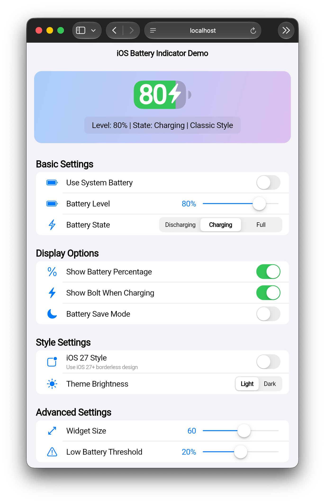
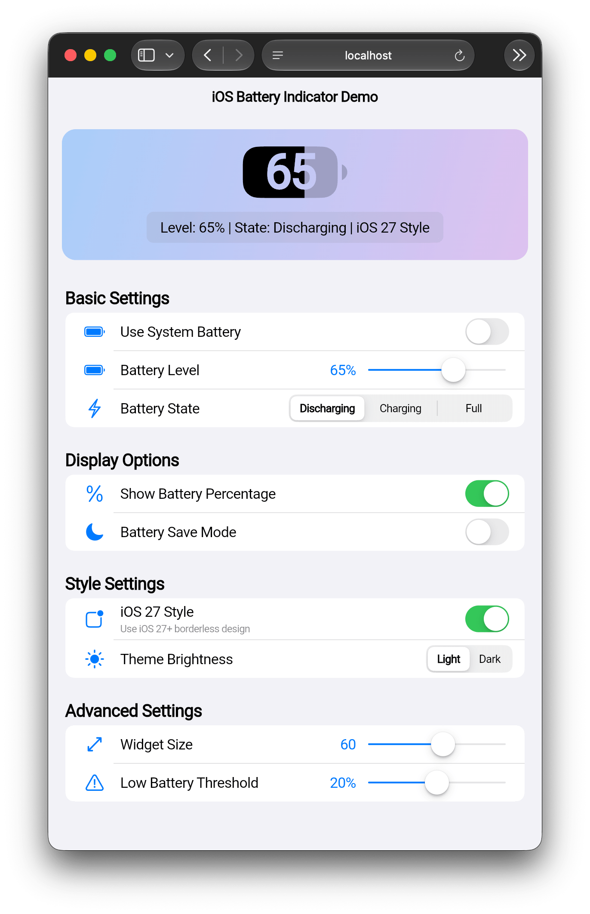
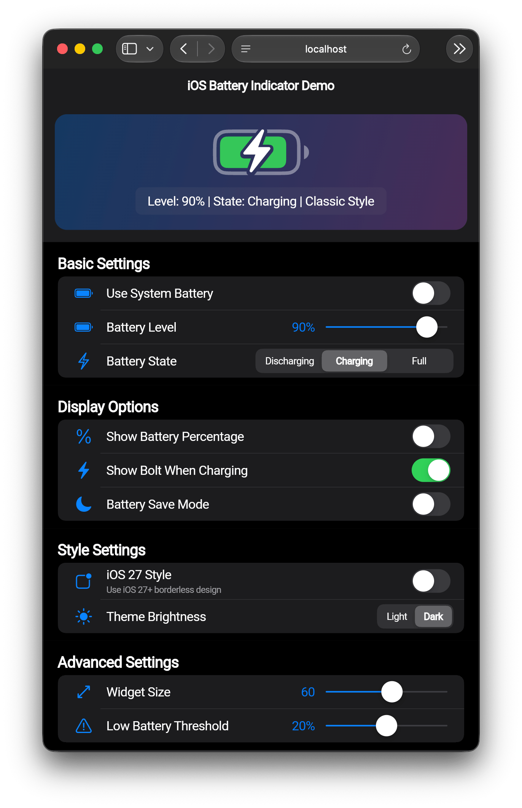
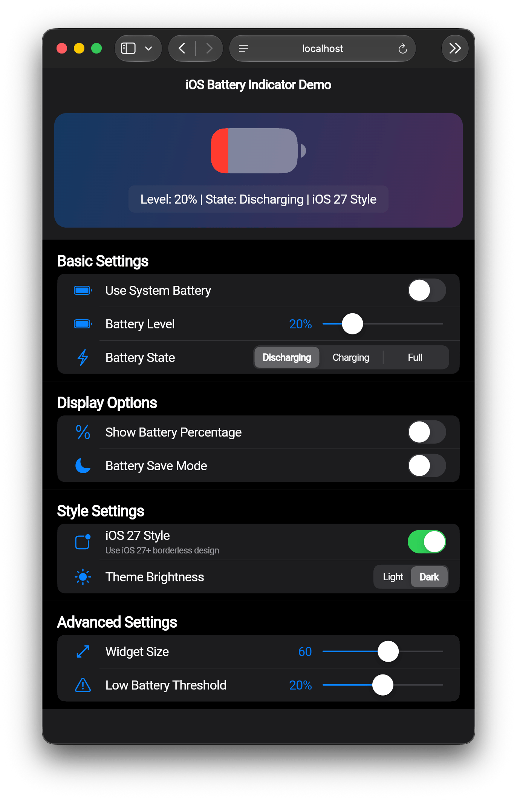

# 🔋 iOS 电池指示器

一个复刻 iOS 原生电池指示器的 Flutter 组件，支持 iOS 27 风格以及自动监测系统电池。

[](https://pub.dev/packages/ios_battery_indicator)
[](LICENSE)
[](https://runoob-coder.github.io/ios_battery_indicator/)
[](https://pub.dev/documentation/ios_battery_indicator/latest/)
[](https://github.com/runoob-coder/ios_battery_indicator)

Language: [English](README.md) | 中文

| [](https://runoob-coder.github.io/ios_battery_indicator/) | [](https://runoob-coder.github.io/ios_battery_indicator/) | [](https://runoob-coder.github.io/ios_battery_indicator/) | [](https://runoob-coder.github.io/ios_battery_indicator/) |
|------------------------------------------------------------------------------------------------------|------------------------------------------------------------------------------------------------------|------------------------------------------------------------------------------------------------------|------------------------------------------------------------------------------------------------------|

## ✨ 特性

- **原生 iOS 外观** — 精确复刻 iOS 电池图标，采用圆角超椭圆形状和合适的尺寸。
- **自动读取系统电池** — 未手动指定时，实时从设备读取电池电量、充电状态和低功耗模式。
- **手动控制** — 可选择性传入 `batteryLevel`、`batteryState` 和 `isInBatterySaveMode` 用于演示或自定义场景。
- **iOS 27 风格** — 支持 iOS 27 引入的无边框设计，可自动检测 iOS 版本。
- **充电闪电图标** — 充电时使用原生 Cupertino 图标字体渲染闪电 (⚡) 符号。
- **镂空百分比** — 在正常放电模式下，百分比文字通过镂空效果穿透填充区域，呈现精致的外观。
- **低电量警告** — 电量低于可配置阈值（10–30，默认 20）时，指示器变为红色。
- **省电模式** — 低功耗模式激活时，电池轨道变为黄色。
- **亮色 / 深色模式** — 自动适配环境的 `Brightness`，也可通过 `brightness` 属性强制指定。
- **流畅动画** — 填充进度、颜色变化、充电闪电图标切换以及基础/百分比显示之间的交叉淡入淡出，所有动画时长均可通过 `animationDuration` 配置。

## 🚀 快速开始

通过 pub.dev 安装 → [pub.dev/packages/ios_battery_indicator/install](https://pub.dev/packages/ios_battery_indicator/install)

[在线演示](https://runoob-coder.github.io/ios_battery_indicator/) — 立即体验

### ⚙️ 平台配置

此包依赖 `battery_plus` 和 `device_info_plus`。iOS 和 macOS 无需额外配置。Android 需确保 `android/app/build.gradle.kts` 目标 API 21 或更高（Flutter 默认模板已满足此要求）。

## 📖 使用示例

### 🤖 自动模式（系统电池）

最简单的用法 — 组件从设备读取所有信息：

```dart
IosBatteryIndicator()
```

- 默认开启电池百分比显示。
- 每 30 秒轮询一次系统电池电量。
- 监听 `Battery.onBatteryStateChanged` 以获取实时状态更新。
- 自动检测 iOS 27+ 并渲染无边框风格。

### 🎮 手动控制

提供明确的值：

```dart
IosBatteryIndicator(
  batteryLevel: 80,
  batteryState: BatteryState.charging,
);
```

### 🎛️ 控制显示选项

```dart
IosBatteryIndicator(
  showBatteryPercentage: false,   // 隐藏百分比数字
  chargingWithBolt: false,        // 充电时隐藏闪电图标
);
```

### 🎨 样式设置

```dart
IosBatteryIndicator(
  isIOS27Style: true,             // 强制 iOS 27 无边框风格
  brightness: Brightness.dark,    // 强制深色模式颜色
  lowBatteryThreshold: 15,        // 电量 ≤ 15% 时变红
  animationDuration: const Duration(milliseconds: 500),  // 放慢动画速度
);
```

### 📐 尺寸设置

使用 `height` 或 `width`（互斥）来缩放：

```dart
IosBatteryIndicator(height: 36);   // 36 逻辑像素高，宽度自适应
```

```dart
IosBatteryIndicator(width: 40);   // 40 逻辑像素宽，高度自适应
```

### 🖌️ 自定义主题

可通过 `ThemeData.extensions` 提供 `BatteryIndicatorTheme` 来自定义颜色：

```dart
MaterialApp(
  theme: ThemeData(
    extensions: [
      BatteryIndicatorTheme(
        bgColor: Colors.grey.withValues(alpha: .3),
        dischargingTrackColor: Colors.blue,
        contentColor: Colors.blue,
        contentAntiColor: Colors.white,
      ),
    ],
  ),
  home: /* ... */,
);
```

对于 Cupertino 应用，将指示器包裹在 `Theme` 组件中或使用 `CupertinoThemeData` 扩展。

## 📚 API 参考

### 🧩 `IosBatteryIndicator`

| 属性 | 类型 | 默认值 | 描述 |
| --- | --- | --- | --- |
| `height` | `double?` | `null` | 首选高度，与 `width` 互斥。 |
| `width` | `double?` | `null` | 首选宽度，与 `height` 互斥。 |
| `batteryLevel` | `int?` | `null` | 电池电量 0–100，为 `null` 时从系统读取。 |
| `batteryState` | `BatteryState?` | `null` | 充电 / 放电 / 已满。为 `null` 时从系统读取。 |
| `showBatteryPercentage` | `bool` | `true` | 是否在指示器内显示百分比数字。 |
| `isInBatterySaveMode` | `bool?` | `null` | 低功耗模式。为 `null` 时从系统读取。 |
| `lowBatteryThreshold` | `int` | `20` | 低电量阈值（10–30），低于此值时指示器变红。 |
| `chargingWithBolt` | `bool` | `true` | 充电时是否显示闪电图标。 |
| `isIOS27Style` | `bool?` | `null` | 强制 iOS 27 风格。为 `null` 时自动检测 iOS 版本。 |
| `brightness` | `Brightness?` | `null` | 强制亮色或深色。为 `null` 时使用环境亮度。 |
| `animationDuration` | `Duration` | `Duration(milliseconds: 250)` | 电池指示器动画时长（填充、颜色、闪电图标等）。 |
| `themeAnimationDuration` | `Duration` | `kThemeAnimationDuration` | 主题切换的动画时长。 |

### 🎨 `BatteryIndicatorTheme`

| 属性 | 类型 | 描述 |
| --- | --- | --- |
| `bgColor` | `Color` | 电池外壳的背景/边框颜色。 |
| `dischargingTrackColor` | `Color` | 放电（正常状态）时的填充颜色。 |
| `contentColor` | `Color` | 用于闪电图标和镂空文字描边的颜色。 |
| `contentAntiColor` | `Color` | 纯色模式下百分比文字的颜色。 |

工厂构造函数 `BatteryIndicatorTheme.light()` 和 `BatteryIndicatorTheme.dark()` 提供了合理的默认值。

### 👁️ 视觉状态

| 状态 | 外观 |
| --- | --- |
| 正常放电 | 外壳边框 + 与电量成比例的实心填充。 |
| 充电中 | 绿色填充 + 闪电图标（如果 `chargingWithBolt` 为 true）。 |
| 已满（100%） | 绿色填充，无闪电图标。 |
| 低电量（≤ 阈值） | 红色填充，纯色（无镂空）。 |
| 省电模式 | 黄色填充。 |

## ℹ️ 更多信息

- **仓库**: [github.com/runoob-coder/ios_battery_indicator](https://github.com/runoob-coder/ios_battery_indicator)
- **问题反馈**: [github.com/runoob-coder/ios_battery_indicator/issues](https://github.com/runoob-coder/ios_battery_indicator/issues)
- **示例应用**: 查看 `example/` 目录获取完整的交互式演示，可实时调整每个属性。
- **贡献**: 欢迎提交 Pull Request 和 Issue！

## 💛 支持

如果 `ios_battery_indicator` 帮助了你，请考虑支持它，只需几秒即可帮助更多 Flutter 开发者发现此库。

- ⭐ [GitHub 上点星](https://github.com/runoob-coder/ios_battery_indicator)
- 👍 [pub.dev 上点赞](https://pub.dev/packages/ios_battery_indicator)

## ☕️ 请我喝咖啡

<a href="https://ko-fi.com/noob_coder" target="_blank">
  
</a>